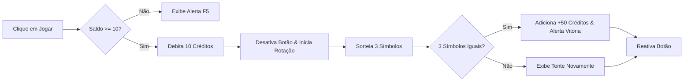

<div align="center">

# 🎰 Cassino 2.0 — Caça-Níquel Web Interativo

<p align="center">
  
  
  
  
</p>

<p align="center">
  Um jogo de slot machine moderno e educativo construído inteiramente em <b>JavaScript Vanilla</b>, demonstrando manipulação dinâmica do DOM, gerenciamento de saldo em tempo real e animações temporizadas.
</p>

---

</div>

## 🎮 Regras e Mecânicas de Jogo

| Regra / Parâmetro | Valor | Descrição |
|---|---|---|
| 💰 **Saldo Inicial** | `100 créditos` | Crédito disponibilizado para iniciar a partida |
| 🕹️ **Custo por Rodada** | `10 créditos` | Debitado automaticamente a cada giro |
| 🏆 **Prêmio Jackpot** | `+50 créditos` | Concedido ao alinhar 3 símbolos idênticos |
| 🍒 **Símbolos Sorteados** | `🍒 🍋 🍉 ⭐ 7️⃣` | Sorteio randômico independente por rolo |

---

## ✨ Destaques de Implementação



- **Prevenção de Cliques Múltiplos:** Botão desabilitado (`disabled = true`) durante a rolagem dos rolos.
- **Manipulação Dinâmica:** Atualização visual imediata de saldos e mensagens coloridas.
- **Design Responsivo:** Centralização com Flexbox, sombras em relevo (`inset shadow`) e QR Code Pix integrado.

---

## 🚀 Como Executar Localmente

```bash
# Clonar o repositório
git clone https://github.com/lucaxaviers/cassino-js.git

# Acessar a pasta
cd cassino-js

# Abrir no navegador
start index.html
```

---

<div align="center">
  <sub>Desenvolvido no contexto de Engenharia de Software</sub>
</div>
